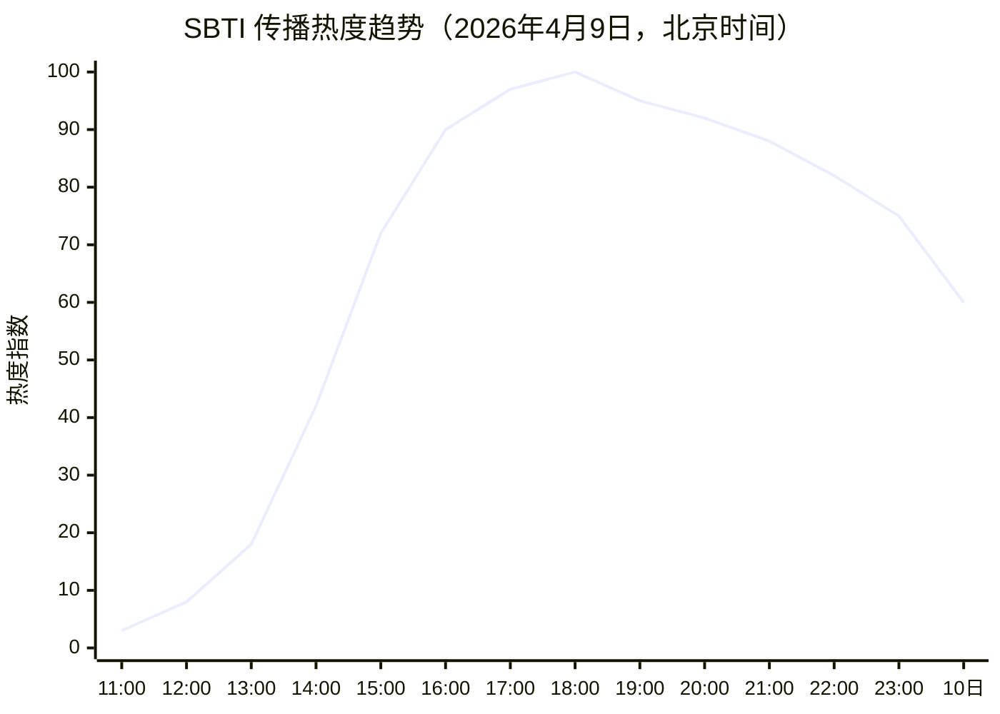

# 🧠 SBTI 人格测试 — AI Skill 版

> **MBTI 已经过时，SBTI 来了。**

将 2026 年 4 月全网爆火的 [SBTI 人格测试](https://sbti.unun.dev)搬进 AI 对话。30 道毒舌题目、15 个维度、26 种荒诞人格，现在可以用对话的方式完成测试。

原版作者：B站 [@蛆肉儿串儿](https://space.bilibili.com/417038183)（UID 417038183）

---

## 📅 事件时间线：从一个劝酒梗到全网狂欢

SBTI 的爆火堪称中文互联网 2026 年最魔幻的事件之一。一个为了劝朋友戒酒而做的小测试，在不到 **10 小时**内席卷了整个中文互联网。

```mermaid
timeline
    title SBTI 爆火全记录 · 2026年4月9日（北京时间）
    section 🌱 诞生 · 11:00
      4月9日 上午 11:00
        : B站 UP主「蛆肉儿串儿」发布视频
        : 标题："我做了个盗版SBTI测试，且骗人来测。"
        : BV号 BV1LpDHByET6
        : 初衷竟是为了劝一个酒鬼朋友戒酒
        : 特意设计了隐藏人格「DRUNK / 酒鬼」
    section 🔥 扩散 · 12:00—14:00
      4月9日 午间
        : 视频进入 B站 首页推荐流
        : 测试链接在弹幕和评论区快速扩散
        : 第一批测试者开始在微信朋友圈晒结果截图
        : "我居然是个死者" "我是吗喽" 等截图出现
    section 💥 爆发 · 14:00—17:00
      4月9日 下午
        : #SBTI测试# 冲上微博热搜
        : 瞬时流量激增，原始测试网站被挤崩
        : #sbti测试网站崩了# 本身也成了微博热搜话题
        : 用户被迫"云测试"——围观他人截图替代自测
        : 小红书、抖音、豆瓣同步刷屏
    section 🌊 蔓延 · 17:00—20:00
      4月9日 傍晚
        : 搜狐（17:06）、新浪（17:12）等媒体首批跟进报道
        : 开发者社区闻风而动
        : GitHub 用户 UnluckyNinja 逆向前端代码，部署镜像站 sbti.unun.dev
        : 多个镜像站密集上线：sbti.dev、sbti.jerryz.com.cn 等
        : V2EX、LINUX DO 等技术社区跟进讨论
    section 🌍 全民狂欢 · 20:00—
      4月9日 晚间 — 4月10日
        : 游民星空（20:43）等游戏/科技媒体跟进
        : 微信朋友圈被 SBTI 结果截图彻底刷屏
        : 海外社交平台 X/Twitter 出现英文讨论
        : 维基百科、百度百科同步建立词条
        : B站原视频播放量突破 66 万，点赞 3.3 万，转发 2.1 万
```

---

## 📈 传播趋势

从 B站 一条视频到全网刷屏，SBTI 的传播曲线是一条教科书级别的病毒式增长。



| 时间节点 | 事件 | 传播平台 | 热度 |
|:---|:---|:---|:---:|
| 4/9 11:00 | B站视频首发 | B站 | ▓░░░░ |
| 4/9 12:00—14:00 | B站推荐 + 朋友圈扩散 | B站 · 微信 | ▓▓░░░ |
| 4/9 14:00—15:00 | 冲上微博热搜 · 网站崩溃 | 微博 · B站 · 微信 | ▓▓▓░░ |
| 4/9 15:00—17:00 | "云测试" · 小红书/抖音/豆瓣跟进 | 全平台 | ▓▓▓▓░ |
| 4/9 17:00—20:00 | 媒体报道 · 镜像站涌现 · 开发者社区 | 全平台 + 媒体 + GitHub | ▓▓▓▓▓ |
| 4/9 20:00— | 全民刷屏 · 海外传播 · 百科建词条 | 全平台 + 海外 | ▓▓▓▓▓ |
| 4/10 | 持续发酵 · 二创涌现 | 全平台 | ▓▓▓▓░ |

### 关键数据

| 指标 | 数据 |
|:---|:---|
| B站原视频播放量 | 667,417+ |
| B站点赞 / 投币 / 收藏 / 转发 | 33,465 / 12,657 / 8,906 / 21,554 |
| 微博热搜话题 | #SBTI测试#、#sbti测试网站崩了# |
| GitHub 镜像站数量 | 10+ |
| 人格类型总数 | 26 种（含 1 个隐藏 + 1 个兜底） |
| 测试题目数 | 30 题 + 2 道饮酒彩蛋 |
| 测试维度数 | 15 维度 × 5 大模型 |

---

## 🤔 为什么 SBTI 能火？

### 1. 精准戳中了年轻人的自嘲情绪

SBTI 的人格标签不是 INFJ、ENFP 这种正经的心理学术语，而是「死者」「草者」「吗喽」「愤世者」「废物」「小丑」——每一个都是年轻人在社交媒体上的自我调侃。当你测出来自己是个「DEAD（死者）」，你不会沮丧，你会笑着把截图发到朋友圈。

> "恭喜您，您测出了全中国最为罕见的人格"——每种人格的开头都是这句话，每个人都是"最罕见的"，荒诞本身就是安慰。

### 2. 题目足够抽象、足够有梗

普通心理测试问你"你是否经常感到焦虑"，SBTI 问你：

> *"你因便秘坐在马桶上（已长达30分钟），拉不出很难受。此时你更像——"*

> *"突然某一天，我意识到人生哪有什么他妈的狗屁意义，人不过是和动物一样被各种欲望支配着……"*

这种粗粝、直白、带脏字的表达方式，恰恰是当代年轻人最真实的内心独白。

### 3. 描述文案是真的有文采

虽然是"娱乐测试"，但每种人格的描述都写得极其用心——SCP 基金会报告体、宇宙级比喻、游戏通关叙事……SHIT（愤世者）的描述甚至成了爆款文案：

> *"嘴上：这个世界就是一坨 shit，赶紧毁灭吧。手上：第二天早上七点准时起床，挤上 shit 一样的地铁，去干那份 shit 一样的工作。"*

### 4. 社交货币属性极强

测试结果天然适合分享——一张结果卡片就是一个社交话题。"你是什么人格？"取代了"你是什么MBTI？"成为新的社交破冰方式。

### 5. 隐藏人格彩蛋

「DRUNK / 酒鬼」作为隐藏人格，需要在特定题目选择"将白酒灌在保温杯当白开水喝"才能触发。这种彩蛋设计让用户有探索欲，也制造了话题。

### 6. 网站崩溃反向营销

原始网站被挤崩、镜像站涌现、"云测试"现象——这些意外事件本身就制造了二次传播，"你也打不开吗"成了新的社交话题。

---

## 🎮 这个 Skill 能做什么？

本项目将 SBTI 测试改造为 **AI 对话体验**，支持四种玩法：

### 模式一：对话式测评 💬

不再是冷冰冰的网页表单，而是和 AI 毒舌聊天的过程中完成测试。

- 5 轮对话，覆盖 15 个维度、30 道题
- AI 会用毒舌幽默的方式抛出问题，你只需要自然聊天
- 后台默默评分，你看不到任何计算过程
- 包含完整的饮酒关卡彩蛋，可触发隐藏人格 DRUNK
- 结果输出包含：主类型卡片 + 完整人格解读 + 15维度详解 + 反差点评

### 模式二：反向人格诊断 🔍

贴一段聊天记录、朋友圈文案、吵架发言，AI 反推这段文字背后的 SBTI 人格。

### 模式三：毒舌人格陪聊 🎭

测完后（或直接指定一种人格），让 AI 用该人格的视角和语气跟你聊天。想知道「愤世者」会怎么评价你的工作？「吗喽」会怎么安慰你失恋？试试就知道。

### 模式四：角色扮演 Prompt 生成 ✍️

为指定人格生成可复用的 prompt 模板，包括日常回复语气、吐槽点评、反差安慰三种风格。

---

## 📁 文件结构

```
sbti-skill/
├── README.md          # 本文件
├── LICENSE            # MIT 开源协议
├── SKILL.md           # Skill 主逻辑：模式路由、对话流程、评分算法
└── data/
    ├── questions.md   # 30 道常规题 + 2 道饮酒关卡题
    ├── types.md       # 26 种人格类型（含隐藏 DRUNK + 兜底 HHHH）
    └── dimensions.md  # 15 维度定义 + L/M/H 三档解释
```

## 🚀 安装与使用

### 安装到 Claude Code

```bash
# 克隆仓库到 Claude Code 的 skills 目录
git clone https://github.com/xiaotonng/sbti-skill.git ~/.claude/skills/sbti
```

或者在已有项目中作为子目录使用：

```bash
# 克隆到项目的 .claude/skills/ 下
mkdir -p .claude/skills
git clone https://github.com/xiaotonng/sbti-skill.git .claude/skills/sbti
```

### 使用方式

在 Claude Code 对话中：

```
/sbti              # 开始对话式测评
/sbti 测一测        # 同上
/sbti 分析 <文本>   # 反向人格诊断
/sbti 陪聊 SHIT    # 用愤世者人格陪你聊天
/sbti prompt DEAD  # 生成死者人格的 prompt 模板
```

或者直接说自然语言：

- "帮我测一下 SBTI"
- "用小丑的语气跟我聊天"
- "分析一下这段文字是什么人格"

---

## 🙏 致谢

- **原作者**：B站 UP主 [@蛆肉儿串儿](https://space.bilibili.com/417038183)，创造了这个荒诞又温暖的测试
- **开源镜像**：[UnluckyNinja/SBTI-test](https://github.com/UnluckyNinja/SBTI-test)，在原站崩溃时为大家续命
- **Skill 参考**：[c0dedance/sbti-skill](https://github.com/c0dedance/sbti-skill)，首个将 SBTI 做成 Skill 的项目

---

## ⚠️ 免责声明

本测试**纯属娱乐**，没有任何心理学依据。请不要拿它当诊断、面试、相亲、分手、招魂、算命或人生判决书。如果你测出来是「死者」，别慌——你还活着呢。

---

<p align="center">
  <i>MBTI 把你分成 16 种人，SBTI 告诉你——你根本不在人类范畴内。</i>
</p>
